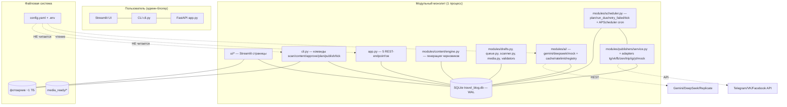

# Архитектурное ревью — Travel Blog Automation Platform
> Выполнено от лица персона-агента **Software Architect** (agency-agents) · дата: 2026-09-04 · модель: deepseek-chat (leaf) · 48 API-вызовов, ~13 мин
> Репо: [dmpotekhin/travel-blog-app](https://github.com/dmpotekhin/travel-blog-app) · ветка main · прогон тестов: 59 passed (82 с). Только ревью/анализ — **код не изменялся**. Это разовый анализ, НЕ канонический документ (канон — `ARCHITECTURE.md`).

---
# Архитектурное ревью — Travel Blog Automation Platform (travel-blog-app)

> Роль: Software Architect. Объект: `git@github.com:dmpotekhin/travel-blog-app.git`, ветка `main`, HEAD `258ae2b` («Initial commit»), дерево чистое. Метод: полное чтение ARCHITECTURE.md (432 стр.), README.md, core/*.py, modules/**/*.py, ui/*.py, app.py, cli.py, config.yaml, .planning/STATE.md; карта импортов; прогон тестов (59 passed за 82 с, 1 warning о deprecated httpx в starlette.testclient). Все ссылки file:line — на реально прочитанный код.

---

## 1. Резюме

Сильная сторона проекта — дисциплина слоёв и «честная автоматизация» как принцип: единственный слой, трогающий SQL, — `core/database.py`; внешние сервисы (публикация, AI, медиа) — только за ABC-адаптерами; машины состояний централизованы в `core/models.py`; dry_run по умолчанию; секреты только в `.env`. Это редкая для агентно-сгенерированного кода культура.

Слабые места — **не архитектура, а её рассинхрон с кодом**: часть контрактов из ARCHITECTURE.md/README.md в коде не существует (валидируемый `ContentPack`, этап медиа для travel-постов, «автоматический VK»), часть конфигурации молча не применяется (весь `config.yaml` для API/CLI, флаги `publishing.*`), а главный путь публикации обходит собственную машину состояний. Сейчас это латентно (дефолты совпадают с config.yaml, dry_run прячет адаптеры), но при первом реальном запуске на архив 255 городов/1 ТБ проявится как «застрявшие» FAILED-публикации и дубликаты.

Оценка: **архитектура M1 здорова и масштабируема в рамках modular monolith; требуется «сверка контрактов» (docs+code), а не переписывание.**

---

## 2. Заявленная архитектура (документация)

Из ARCHITECTURE.md и README.md:

- Модульный монолит со слоями UI → Application Services → Business logic → Repositories (`core/database.py` — «the ONLY place that touches SQL», ARCHITECTURE.md:23) → SQLite (WAL).
- «Publishers never talk to the DB directly — they receive a validated ContentPack» (ARCHITECTURE.md:44); при успехе «мы производим полностью подготовленный ContentPack + media» (ARCHITECTURE.md:202).
- Честные режимы платформ: auto (Telegram, VK), partial (Facebook), manual-assisted (Zen/Trip.com/Instagram/YouTube) — README.md:48, ARCHITECTURE §7; Telegram «text/photo/media-group/video via JSON POST» (ARCHITECTURE.md:193).
- Pipeline: scan → EXIF/GPS → очередь городов → выбор фото → AI-анализ → база-история → платформенные варианты → черновики → human approval → **MEDIA PROCESSING (presets)** → планировщик → публикаторы (README.md:35). `plan()` «maps approved, **media-ready** drafts -> Publication rows» (ARCHITECTURE.md:278).
- Валидация: «Каждый тип контента **автоматически валидируется** перед публикацией» (README.md:57); мягкий гейт по умолчанию (D12, ARCHITECTURE.md:402).
- Retry: «Permanent и validation-ошибки прекращают ретраи немедленно» (ARCHITECTURE.md:241).
- Конфигурация: `config.yaml` «настройки (без секретов)»; `publishing` — «флаги … — включать площадку или нет» (README.md:257).

## 3. Фактическая архитектура (подтверждено кодом)

### 3.1 C4 — контейнеры



**Факт №0 (важный): `config.yaml` читается только тремя путями** — `get_settings()` как fallback в модулях (queue.py:42), ratelimit (ai/ratelimit.py:22) и Streamlit-страница настроек (settings_page.py:57). **FastAPI и CLI его не читают вообще** (app.py:31 `Config()`, cli.py:29 `Config()` — чистые дефолты).

### 3.2 C4 — поток данных (L2, фактический)

```mermaid
flowchart LR
    A[scan: папка Город/Год → City/Photo] --> B[queue: приоритет/год → QUEUED]
    B --> C[engine.process_city: claim PROCESSING → выбор фото → AI-анализ → база-история → адаптация для ВСЕХ 7 платформ → Draft per (city,platform)]
    C --> D[Draft PENDING → approve/auto_approve tg+vk]
    D --> E[plan: approved → Publication SCHEDULED / MANUAL]
    E --> F[run_due: publish via PublishService] --> G[Publication PUBLISHED/FAILED]
    F -.ретраи с бэкоффом.-> E
    D -.manual-платформы: mark_manual_published.-> G
    E -.VibeCoding cron.-> H[VibeCodingPublisherService → те же адаптеры]
```

### 3.3 Что подтвердилось (плюсы)

1. **Единственный слой SQL** — все 30 импортов `core.database` берут класс `Database`; конкретные адаптеры публикации (telegram/vk/facebook/manual/mock) БД не трогают.
2. **Машины состояний централизованы**: все таблицы переходов city/draft/publication/vibecoding — в `core/models.py:93-127`, проверки `check_transition` вызываются из checked-методов БД (database.py:332, 540, 645).
3. **ABC-адаптеры**: `BasePublisher` (publishers/base.py:36-66), `BaseAIProvider` (ai/base.py), `MediaProcessor`; dry_run → MockPublisher через registry.
4. **Честная ручная публикация**: manual-платформы никогда не получают `published` от адаптера (ManualPublisher, base.py:65-66, service.py:52-55), ручное завершение — `mark_manual_published` (service.py:90-129).
5. **Одна транзакционная дисциплина SQLite**: один aiosqlite-коннект на event loop + один asyncio.Lock + WAL + busy_timeout=5000 (database.py:199-220) — корректно для single-user.
6. **Идемпотентность вставок** через UNIQUE-ограничения (database.py:49-138) и `save_published`-upsert (database.py:579).
7. Тесты модульные + e2e (scan→publish), 59 passed (прогон подтверждён).

## 4. Bounded contexts / доменная модель

Формальных пакетных границ нет (общие `core.models` — классический shared kernel модульного монолита, для этого масштаба оправдано). Неявно выделяются контексты:

| Контекст | Артефакты | Оценка |
|---|---|---|
| Photo Archive (скан/EXIF/дедуп) | scanner.py, ingest.py, City/Photo | чистый |
| Content Factory (AI-анализ, истории, черновики) | content/, ai/, drafts.py | чистый |
| Publishing (планирование, адаптеры, publication-статусы) | scheduler.py, publishers/, Publication | **главные проблемы здесь** |
| VibeCoding (посты о вайбкодинге) | vibecoding_*, publishers/vibecoding.py | **нарушает границу Draft-домена** |
| Admin/Observability | ui/, app.py, stats.py | ок |

Симптом слабой границы №1 — **VibeCoding фабрикует фейковый travel-Draft как «перевозчика»** в общий контракт `BasePublisher`: `m.Draft(city_id=0, platform=..., status=APPROVED)` (publishers/vibecoding.py:74-80). Сентинел `city_id=0` разъезжается по publication-логике и отчётам, статус APPROVED присваивается несуществующей в БД сущности, а вторичная семантика Draft (photos_json, city) — пустая. Это признак того, что контракт «адаптер принимает Draft» слишком узкий/смешанный: публикатору нужен «готовый пост с медиа», а не черновик travel-домена.

Симптом №2 — **`ContentPack` — мёртвый тип**: объявлен (models.py:301-316), нигде не конструируется (`ContentPack(` — 0 совпадений по коду), хотя именно он назван контрактом в ARCHITECTURE.md:44,202. Реальный контракт — «сырой `Draft` + пути оригинальных фото» без шага валидации.

## 5. Проверка направлений зависимостей

| Правило (по ARCHITECTURE) | Статус | Доказательство |
|---|---|---|
| core → modules запрещён (core не знает о модулях) | ✅ соблюдено | core/* не импортирует modules/* |
| SQL — только core/database.py | ✅ соблюдено | 30 мест импорта — только класс `Database`; адаптеры не пишут SQL |
| Publishers не трогают БД напрямую | ⚠️ частично | адаптеры чисты, но **конструктору каждого адаптера передаётся `db`** (base.py:41-44) и `VibeCodingPublisherService` (это application-сервис внутри publishers/) пишет статусы сам (vibecoding.py:94-100); правило «не знают о БД» держится на самодисциплине, а не на типе |
| «Publishers receive a validated ContentPack» | ❌ дрейф | контракт — `publish(draft: Draft, media_paths)` (base.py:61); ContentPack не создаётся (models.py:301, 0 вызовов); шага «валидация контента перед публикацией» для tg/vk/fb нет |
| UI → провайдеры напрямую | ✅ соблюдено | ui/* импортируют сервисы и Database (dashboard.py:30-37), не адаптеры/провайдеры |
| Контроллеры не обходят use cases | ⚠️ | FastAPI идёт через Scheduler/StatsService (app.py:43-97), но `pipeline_content` инстанцирует ContentEngine прямо в обработчике (app.py:93-97) — приемлемо |
| Домен не зависит от framework | ✅ | core/models.py — чистые pydantic-dataclass'ы + таблицы переходов; UI-зависимости не протекают в ядро |
| Внешние сервисы только через адаптеры | ⚠️ | везде да, **кроме** vibecoding_generator.py, где прямой httpx-код к Replicate/OpenAI/HF инкапсулирован в ImageGenerator без ABC |

## 6. Архитектурные смэллы и риски (с доказательствами)

### F1 [Высокий] Две системы конфигурации; `config.yaml` игнорируется API/CLI

`app.py:31` и `cli.py:29` создают `Config()` (все значения — дефолты pydantic) и никогда не зовут `load_config_file()/get_settings()` (core/config.py:273-298). YAML читают лишь fallback-пути (queue.py:42) и UI (settings_page.py:57). Сегодня расхождение латентно, но **первая же правка config.yaml** (выключить площадку, `dry_run: false`, сменить провайдера/расписание/лимиты, включить `block_non_compliant`) не возымеет эффекта при запуске через `./run.sh`, CLI или API. Особенно опасно: пользователь верит, что `dry_run: false` включает реальную публикацию — а FastAPI/CLI продолжат работать на дефолте.

### F2 [Высокий] Флаги `publishing.*` «мёртвые» для travel-конвейера

`BasePublisher.enabled` (base.py:46-53) не вызывается нигде в коде (grep `.enabled` — только `vibecoding.enabled` в scheduler.py:232 и UI). ContentEngine генерирует черновики для **всех 7 платформ** (`platforms or Platform`, engine.py:49; `asyncio.gather` по всем, engine.py:138), plan() планирует все (scheduler.py:94-123), run_due публикует без проверки флагов. README.md:257 документирует `publishing` как «включать площадку или нет». Отключение площадки в config.yaml не остановит ни генерацию (и 7 AI-вызовов DeepSeek на город не сократятся), ни публикацию.

### F3 [Высокий] «Автоматический VK» фактически всегда FAILED для travel-постов

Travel-черновик всегда содержит фото (`photos_json`), а VK-адаптер при наличии media возвращает `PublishResult(success=False, manual=False, status_hint="manual")` с ошибкой «vk photo upload not automated yet» (vk.py:34-37). В PublishService это → `PublicationStatus.FAILED` (service.py:55-56): `manual=False` не даёт перейти в MANUAL. retry_failed переводит FAILED→PENDING с бэкоффом до `max_attempts=3` (scheduler.py:200-215), после чего публикация **навсегда FAILED**, draft остаётся APPROVED, а run_due больше её не трогает. Итог: в реальном (не dry_run) режиме ни один travel-пост на VK не выйдет автоматически — вопреки README.md:48, base.py:8-10 и drafts.py:9-11 («fully-automated platforms (Telegram, VK)»). Плюс: ошибка классифицирована как «manual» в hint, но не в поле `manual` — рассинхрон семантики внутри одного результата.

### F4 [Средний] Основной путь публикации обходит машину состояний Publication

Проверки переходов есть только в `update_publication_status` (database.py:641-647). Успешный путь PublishService пишет статус через generic-сеттер `update_publication(id, **fields)` (service.py:70), который **не проверяет переходы** (database.py:627-640: whitelist полей без check_transition). То же в retry_failed (scheduler.py:208-213). Следствие: по таблице моделей `PENDING → {PROCESSING, FAILED, DISABLED}` (models.py:111), а фактически ретрай-строка уходит PENDING→PUBLISHED напрямую, минуя PROCESSING. Машина состояний для publication — «справочник», а не enforcement; для city/draft enforcement есть (database.py:332, 540). Заявленная в ARCHITECTURE «idempotency guard» (PUBLISHED terminal, models.py:114) работает только через checked-путь.

### F5 [Средний] run_due: «зависшие» SCHEDULED-строки и неполное покрытие валидацией

- Нет approved-черновика → тихий `continue` (scheduler.py:154-155); блок Trip-гейта → `continue` (scheduler.py:160-163). Статус SCHEDULED не меняется, строка остаётся due и **переобрабатывается каждый тик без бэкоффа и уведомления** (нет перехода SCHEDULED→FAILED/backoff). При накоплении таких строк они вечно занимают очередь due.
- Валидационный гейт реализован **только для `trip_com`** (scheduler.py:158-163) и VibeCoding (`_vibe_gate`). Публикации Telegram/VK/Facebook не валидируются вовсе — прямое противоречие README.md:57 «каждый тип контента автоматически валидируется перед публикацией» (D12 в ARCHITECTURE.md:402 описывает гейты как общие).
- `retry_failed` не различает классы ошибок, хотя ARCHITECTURE.md:241 обещает «permanent и validation-ошибки прекращают ретраи немедленно»: любой FAILED с `retry_count<3` ретраится, включая перманентный VK-фото-кейс (F3).

### F6 [Средний] Нет claim/lease: риск двойной публикации при конкурентных тиках

run_due = read-then-act: выборка due (scheduler.py:146) → внешний вызов адаптера → запись статуса (service.py:42-87). Между чтением и записью нет ни атомарного claim (UPDATE … SET status='processing' WHERE id=… AND status='scheduled'), ни версии строки. Запустить тик можно параллельно из трёх точек: CLI (cli.py), API (app.py:80-97), APScheduler-демон (scheduler.build_async_scheduler) — и оба конкурентных тика опубликуют один пост (два сообщения в Telegram-канал). asyncio.Lock в database.py сериализует только SQL, но не «внешний вызов + запись».

### F7 [Средний] Медиа-этап для travel-постов не подключён; молчаливая деградация постов

`prepare_platform_set`/`optimize_image`/`create_video` (modules/media.py) не вызываются ни одним звеном travel-конвейера (grep по коду: только тесты и VibeCoding через `prepare_vibecoding_media`). Черновик хранит пути **оригиналов** фото (service.py:18-25 читает photos_json), и публикаторы получают их как есть: Telegram отправляет **одно** фото и caption, обрезанный до 1024 символов (telegram.py:33-37), Facebook — одно фото (facebook.py), VK — ноль. При том что промпты Telegram требуют 400-700 слов (prompts.py:69-76) и README:35/ARCHITECTURE.md:278 декларируют этап MEDIA PROCESSING и «media-ready drafts» — фактически этап отсутствует, а многофото-пост (до 8 фото в engine) молча превращается в однофото-пост без какой-либо записи об этом.

### F8 [Средний] VibeCoding: частичный успех → дубликаты при повторной публикации

Идемпотентность — только на уровне поста целиком: ранний выход при `status == PUBLISHED` (vibecoding.py:57-62). Если при первом проходе часть auto-платформ успела (например, Telegram) и пост ушёл в PENDING (vibecoding.py:109-120: есть manual-успехи → PENDING), повторный запуск **заново публикует на все платформы**, включая уже успешные (vibecoding.py:71-88): Telegram получит второй пост. `platform_status` пишется (vibecoding.py:100), но перед повторной публикацией не читается. Плюс F8 пересекается с F1: фейковый Draft c `city_id=0` (vibecoding.py:74-80).

### F9 [Низкий] Мёртвый код и дублирование API

- `core/database.py:998-1188`: `set_default_db` + ~20 модульных функций-обёрток, дублирующих методы класса. Ни один из 30 импортов их не использует (все — `from core.database import Database`). Мёртвый дублирующий слой + глобальный мутабельный синглтон-капкан.
- `models.py`: `ContentPack`, `SelectedPhoto`, `BaseStory` не конструируются нигде (см. §4).
- `ai/base.py:70`: внутри функции импортируется `compute_sha256` из `modules.scanner`, но используется локальный `_hash_file` — неиспользуемый импорт-«костыль» + дублирование hashing (scanner.py:50) + скрытая зависимость ai-слоя от pipeline-модуля.
- `BasePublisher.enabled` (base.py:46-53) не вызывается (F2).
- `stats.py`: подсчёт «errors» проверяет `draft.status == "error"`, но такого DraftStatus нет (models.py:42-47) — мёртвая ветка статистики.
- `app.py:88`: `/api/scheduler/publish-due` фильтрует `getattr(r, "success", False)` — у `Publication` нет поля success, ответ всегда `{"published": []}` (даже когда публикации прошли или упали).
- ui/* дублируют sys.path-bootstrap в 4 файлах (dashboard.py:16-17, settings_page.py:13-15, vibecoding_page.py:13-15, validation_view.py:11-13).
- `settings_page.py:28-35` переписывает config.yaml через `yaml.safe_load/safe_dump` — **все комментарии и форматирование config.yaml стираются** при сохранении любых настроек (файл — основной источник документации конфигурации проекта).

### F10 [Низкий] Scanner: возврат ранее-MISSING файла с неизменным mtime

Инкрементальный скан пропускает файлы с тем же размером+mtime (scanner.py:274-281), а `_mark_missing` ранее пометила строку MISSING (scanner.py:343-350). Если отсутствовавший файл вернулся с оригинальным mtime (например, архив восстановлен из бэкапа), строка навсегда останется MISSING.

### F11 [Низкий] Узкое место производительности — одна сериализация

Один коннект + один asyncio.Lock (database.py:199-220) — корректно, но каждый INSERT/UPDATE сканера идёт отдельной транзакцией под локом: первичный скан ~1 ТБ/сотен тысяч фото будет очень долгим (нет batch-вставок). При параллельной работе UI+скана всё встаёт в одну очередь. Для single-user приемлемо — зафиксировать как осознанное ограничение.

## 7. Документация ↔ код (сводная таблица дрейфа)

| Утверждение документации | Реальность | Ссылки |
|---|---|---|
| Publishers получают «валидированный ContentPack» | Получают сырой Draft+пути; ContentPack не создаётся; валидации перед публикацией нет | ARCHITECTURE.md:44,202; models.py:301; base.py:61; service.py:42 |
| Telegram: text/photo/media-group/video | sendPhoto: 1 фото, caption[:1024]; media-group/video нет | ARCHITECTURE.md:193; telegram.py:33-37 |
| VK — automatic | Фото-посты всегда FAILED → вечный FAILED после 3 ретраев | vk.py:34-37; service.py:55-56; scheduler.py:200-215 |
| plan() берёт «media-ready drafts» | Медиа-этап для travel не существует в коде; plan() берёт все approved | ARCHITECTURE.md:278; scheduler.py:94-123; grep media.py |
| Publishing-флаги «включать площадку или нет» | Флаги не читаются нигде в travel-потоке | README.md:257; base.py:46-53; engine.py:49,138 |
| «Каждый тип контента валидируется перед публикацией» | Гейты только для trip_com и vibecoding | README.md:57; scheduler.py:158-163 |
| Permanent-ошибки не ретраятся | Все FAILED ретраятся до 3 раз | ARCHITECTURE.md:241; scheduler.py:200-215 |
| config.yaml — настройки платформы | API/CLI работают на дефолтах Config() | README.md:249-257; app.py:31; cli.py:29 |

## 8. Рекомендованные ADR

### ADR-101: Единый источник конфигурации (все точки входа читают config.yaml)

- **Статус**: Proposed.
- **Контекст**: F1 — app.py:31/cli.py:29 конструируют `Config()` без загрузки config.yaml; поведение API/CLI расходится с UI и документацией при любой правке YAML.
- **Варианты**: **A.** Внедрять конфиг через lifespan/DI: `cfg = load_config_file()` один раз при старте, пробрасывать в сервисы (явно, тестируемо, но точечные правки). **B.** Убрать конструкторы дефолтов и везде использовать кэшированный `get_settings()` (как уже в queue.py:42; минимум изменений, но глобал-синглтон). Рекомендация: A в точках входа + B как fallback по умолчанию; запретить `Config()` без аргументов (type-checker-правило или приватный конструктор).
- **Decision**: Все точки входа загружают `load_config_file()`; `Config()` без загрузки объявить ошибкой конфигурации; тест «config.yaml == runtime-config» в CI.
- **Consequences**: (+) настройки начинают работать как документировано; (−) приходится трогать все точки входа; ломается «запуск без файла» — решается явным default-профилем.
- **Trade-offs**: получаем единый источник правды и предсказуемость; отдаём простоту «zero-config запуска» и часть глобального доступа к конфигу.

### ADR-102: Честная классификация VK-фото и классов ошибок публикации

- **Статус**: Proposed.
- **Контекст**: F3+F5(retry) — VK-фото-посты гарантированно FAILED; retry_failed не отличает перманентные ошибки от временных.
- **Варианты**: **A.** VK с медиа → `manual=True` (текст подготовлен, человек вставляет фото через VK-клиент), пока не реализован `photos.getWallUploadServer → wall.post`; ввести поле «класс ошибки» (`permanent|retryable`) в PublishResult. **B.** Реализовать загрузку фото в VK API сразу (больше работы, риск rate-limit; зато реальный auto). **C.** (A+B): классификация ошибок сейчас, VK-медиа — отдельной задачей.
- **Decision**: A (классификация) немедленно; B — как отдельный тикет «VK photo upload»; ошибка «photo upload not automated» становится permanent и НЕ ретраится.
- **Consequences**: (+) посты не «сгорают» в FAILED; ретраи тратятся только на retryable; (−) VK остаётся ручным для фото, что надо честно отразить в README:48/§7.
- **Trade-offs**: получаем честность и предсказуемость состояний; отдаём «полный автопилот VK» до реализации upload API.

### ADR-103: Атомарный claim публикации и enforcement машины состояний

- **Статус**: Proposed.
- **Контекст**: F4+F6 — update_publication обходит переходы; run_due без lease допускает двойную публикацию.
- **Варианты**: **A.** Атомарный claim в SQLite: `UPDATE publications SET status='processing' WHERE id=? AND status IN ('scheduled','pending')` → если 0 строк — кто-то уже взял (переход проверяется таблицей моделей до/после); PublishService пишет результат только через `update_publication_status`. **B.** Outbox/журнал публикаций (отдельная таблица событий + worker) — избыточно для одного процесса, но готово к многопроцессности. Рекомендация: A; B — при появлении второго процесса/воркера.
- **Decision**: Ввести claim-метод в Database, единственный путь run_due → publish → `update_publication_status`; success-путь больше не использует generic `update_publication(status=…)`.
- **Consequences**: (+) устраняется двойная публикация; машина состояний становится enforcement; (−) одно дополнительное UPDATE на публикацию; тесты на гонку (asyncio-задачи) обязательны.
- **Trade-offs**: получаем exactly-once-best-effort и целостность статусов; отдаём микропроизводительность (1 UPDATE) и «гибкость» свободной смены статусов.

### ADR-104: Медиа-этап для travel: «оптимизация под лимиты» вместо «пресетов-призраков»

- **Статус**: Proposed.
- **Контекст**: F7 — этап MEDIA PROCESSING декларирован (README:35, ARCHITECTURE.md:278), но не вызван; посты деградируют молча (1 фото/обрезанный текст).
- **Варианты**: **A.** Перед plan() гонять фото через `prepare_platform_set`-логику (resize/size-cap под лимиты платформ, многофото-группы для TG/FB) и хранить `media_ready` пути в Publication; publishers получают готовые пути. **B.** Оставить оригиналы и задокументировать деградацию (1 фото, обрезка) как осознанное упрощение. Рекомендация: A-lite — оптимизация размера/ориентации (оригиналы в 5-10 МБ упираются в лимиты TG/FB уже сейчас), без видео и «пресетов под каждую платформу» до реальной нужды.
- **Decision**: Ввести обязательный этап `media.prepare_platform_set` в конвейер (перед plan), пути — в Publication; в PublishResult добавить поле `degraded: true` при нехватке медиа вместо тихого обрезания.
- **Consequences**: (+) посты перестают молча терять фото/текст; этап оживает в коде; (−) расход диска (media_ready) и время обработки; нужна чистка старых media_ready.
- **Trade-offs**: получаем соответствие заявленному pipeline и качеству постов; отдаём дисковое пространство и простоту «публикуем оригиналы».

### ADR-105: Чистка мёртвого слоя и сверка контрактов (docs as code)

- **Статус**: Proposed.
- **Контекст**: F9 + §7 — 350+ строк мёртвого API (database.py:998-1188), неиспользуемые модели (ContentPack), неиспользуемый `BasePublisher.enabled`, ошибка app.py:88, рассинхрон ARCHITECTURE.md с кодом.
- **Варианты**: **A.** Удалить мёртвый код и починить баги (обёртки database, app.py:88, stats-ветку) + внести в ARCHITECTURE.md/README.md фактические контракты (Draft, а не ContentPack; 1 фото TG; VK-manual) — быстро, без риска. **B.** Полноценный ADR-лог и архитектурные тесты (dependency-rule тесты: core не импортирует modules; проверка, что каждый документированный контракт существует в коде). Рекомендация: A немедленно, B — как «архитектурные тесты» в CI (дёшево на pytest: сканирование import-графа).
- **Decision**: Удалить мёртвый код; починить publish-due API; синхронизировать ARCHITECTURE.md §7/контракты; добавить import-граф-тест в CI.
- **Consequences**: (+) меньше кода для поддержки, документация снова полезна; (−) ручная синхронизация документов требует дисциплины (или автогенерация диаграмм из кода).
- **Trade-offs**: получаем достоверную документацию и меньший объём кода; отдаём «историю» неиспользуемых контрактов и время на правку docs.

## 9. Quality attributes

### Масштабируемость
Реальная цель — single-user + ~3 тыс. подписчиков FB: текущий монолит закрывает задачу. Критично не масштабировать, а **не деградировать**: первичный скан 1 ТБ (F11) — единственное место, где стоит ввести batch-вставки и прогресс-чекпоинты; AI-фаза (7 адаптаций на город) уже кэшируется (ai/cache) и ограничивается ratelimit — при необходимости глубже ограничить параллелизм через очередь городов, а не через городить worker'ы. Если когда-нибудь появится второй процесс — сначала ADR-103 (claim), затем вынос планировщика в единственный выделенный процесс.

### Надёжность
Сильные места: WAL+single-connection, UNIQUE-дедуп, терминальные статусы, честные manual-платформы. Слабые: двойная публикация (F6), зависшие SCHEDULED (F5), перманентный FAILED без человеческого пути наружу кроме ручного requeue (F3), идемпотентность только на уровне целиком для VibeCoding (F8). Мера: метрика «доля постов, потребовавших ручного вмешательства после auto-попытки» должна быть ≈0; сейчас VK даст 100%.

### Поддерживаемость
Высокая для своего размера: слои читаемы, машины состояний — в одном месте, тесты на каждый модуль. Основные риски — дрейф контрактов (ContentPack против Draft), дублирующий API (обёртки database), смешанная семантика Draft из VibeCoding, потеря комментариев config.yaml при сохранении из UI. Рекомендуется: архитектурный тест на import-граф; запрет generic `update_publication(status=…)` вне Database-класса.

### Наблюдаемость
Есть: loguru с ротацией/gzip (core/logging.py), logger.bind по сущностям (scheduler.py:161-162), UI-статистика. Нет: структурированных метрик и трассировки одной «кампании» (город → 7 публикаций): нет общего correlation id между этапами pipeline и между tick'ами; `/api/scheduler/publish-due` всегда возвращает пустой `published` (app.py:88) — API нельзя использовать для контроля. Рекомендации (дёшево): 1) починить publish-due; 2) лог-событие `publication.completed {city,platform,status,duration_ms}` в отдельную таблицу или JSONL — это даст и метрики, и журнал для дашборда; 3) correlation id = tick id/campaign id пробрасывать через logger.bind; 4) метрики для дашборда: время цикла «город → published», счётчики FAILED по платформам, retry-бюджет, cache hit-rate AI (счётчики уже есть в БД: ai_cache).

## 10. Evolution strategy (рост без переписывания)

1. **Оставаться modular monolith**: границы модулей уже честные; следующий шаг — не микросервисы, а *строгие внутренние контракты* (ContentPack/пост-пакет как реальный тип между сервисами и адаптерами; см. ADR-104/105).
2. **Порядок роста**: (а) сверка контрактов и починка багов (ADR-101,102,105) → (б) claim/enforcement (ADR-103) → (в) медиа-этап (ADR-104) → (г) только потом функциональные фичи (новые площадки = новый адаптер + строка в MANUAL_PLATFORMS/таблице §7; новые типы контента = новый валидатор на validation_base, как уже сделано для VibeCoding).
3. **Куда можно расти без боли**: видео (moviepy) — через MediaProcessor-ABC уже предуготовлен слот; мультиаккаунт/команда — потребует мультипроцесс и ADR-103 + отдельный планировщик-процесс; аналитика — через журнал событий публикаций (§9), а не через парсинг таблиц статусов.
4. **Что НЕ делать**: не вводить ORM, event-bus или микросервисы для single-user системы; не расширять shared kernel без причины (VibeCoding уже показал, как чужая сущность ломает Draft-семантику — следующий контент-тип должен получать *собственный* пост-пакет, а не переиспользовать travel-Draft).

## 11. Top-5 приоритетных рекомендаций

1. **Единая загрузка конфигурации (ADR-101)** — иначе первая же правка config.yaml (включая `dry_run: false`) молча не работает через CLI/API; самый дешёвый и самый опасный сейчас дрейф.
2. **Честная классификация VK/ошибок (ADR-102)** — VK-фото-посты гарантированно «сгорают» в FAILED после 3 ретраев; manual-классификация вернёт их человеку, permanent-ошибки перестанут жечь retry-бюджет.
3. **Claim + enforcement статусов публикации (ADR-103)** — устраняет двойную публикацию при конкурентных тиках и делает машину состояний настоящим инвариантом, а не справочником.
4. **Оживить медиа-этап и убрать молчаливую деградацию (ADR-104)** — Telegram/FB публикуют 1 фото с обрезанным текстом, хотя промпты и документация обещают полноценные посты; минимум — оптимизация размеров и явный флаг degraded.
5. **Чистка мёртвого кода + синхронизация docs (ADR-105)** — ~350 строк мёртвых обёрток database, неиспользуемый ContentPack/enabled, баг app.py:88 «всегда пустой published»; архитектурный тест на import-граф закрепит слои.

## 12. Приложение: доказательства (file:line)

F1: app.py:31, cli.py:29, core/config.py:273-298, queue.py:42, settings_page.py:57
F2: base.py:46-53, engine.py:49,138, scheduler.py:94-123, README.md:257
F3: vk.py:34-37, service.py:47-56, scheduler.py:200-215, models.py:42-47
F4: database.py:627-646, service.py:70, scheduler.py:208-213, models.py:110-120
F5: scheduler.py:143-170 (154-155, 158-163), README.md:57, ARCHITECTURE.md:402
F6: scheduler.py:143-170, service.py:42-87, app.py:80-97, database.py:199-220
F7: media.py (нет вызовов из travel-пути), service.py:18-25, telegram.py:33-37, facebook.py, ARCHITECTURE.md:278, prompts.py:69-76
F8: vibecoding.py:57-62, 71-100
F9: database.py:998,1034-1188; models.py:295-321; ai/base.py:70, scanner.py:50; stats.py; app.py:88; dashboard.py:16-17; settings_page.py:13-15,28-35
F10: scanner.py:274-281,343-350
F11: database.py:199-220

**Честные оговорки**: сетевые адаптеры в реальном (не dry_run) режиме не запускались — выводы о поведении VK/TG/FB сделаны по чтению кода адаптеров; интерактивный Streamlit и APScheduler-демон не поднимались; тест-кейсы читались выборочно, но полный прогон 59 тестов выполнен (82 с, 1 warning). Количество строк/файлов сверено с git ls-files.